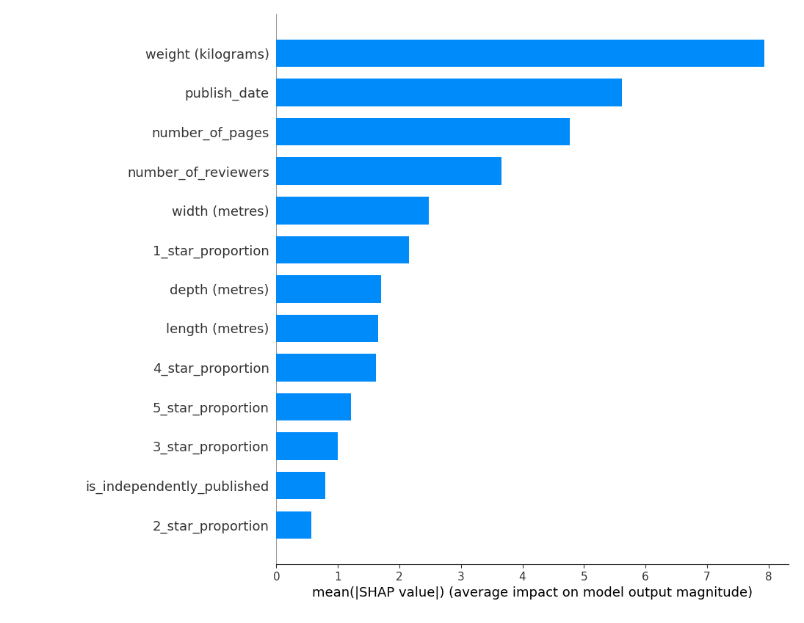
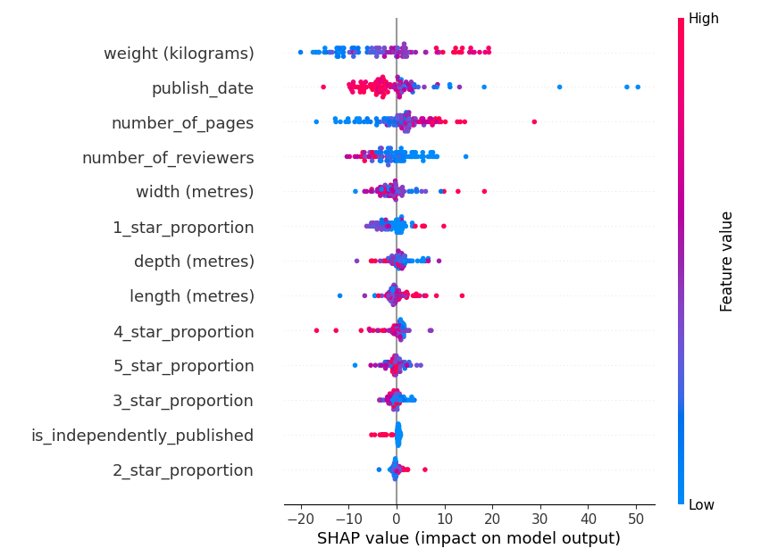

# Portfolio

## Projects

- [Book Price Prediction with XGBoost Regression](#book-price-prediction-with-xgboost-regression)
- [Ingestion of Listed Building Data](#ingestion-of-listed-building-data)

## Book Price Prediction with XGBoost Regression

This project was an experiment, using XGBoost and a publicly available dataset to predict the price of a book given some characteristics.
The main intention of this project was to explore machine learning techniques, including data cleaning and model explainability.

### Motivation: Data Source

The data for this project was sourced from [Kaggle](https://www.kaggle.com/datasets/die9origephit/amazon-data-science-books), a repository of publicly available datasets for machine learning and exploration.
It comes in the format of a comma-separated values (CSV) file, and is a table which contains information about listings for 830 different books on Data Science that are being sold on Amazon.

CSV files are easy to work with, as they are a plain-text file format, meaning that their raw content is human-readable with just a text editor.
The dataset was primarily chosen due to the amount of data cleaning that it would require to be in a suitable state for model training.
Many of the columns in the dataset contain values that should be separated into their own columns through a process called feature extraction.
Feature extraction is the process of transforming data points from their raw source format into a format which is compatible with a machine learning model ([Source: Snowflake](https://www.snowflake.com/guides/feature-extraction-machine-learning/)).
An example of this would be the `dimensions` column, which contains the width, depth, height, and associated measurement unit respectively of each book.
This provides an opportunity to separate each of the dimensions into columns of their own.

This dataset also provides a hyperlink to each book's Amazon listing, in the `complete_link` column.
This means that it is suitable for enrichment, which is a form of feature engineering.
Feature engineering is an umbrella term for preparing data for a machine learning model, and as such encompasses both enrichment and feature extraction.
Enrichment differs from feature extraction in that instead of features of the raw data being transformed, they are instead used as a form of key to help join on features from external sources ([Source: Alteryx](https://www.alteryx.com/glossary/data-enrichment)).
In this case, enrichment would involve scraping and processing data from the provided listing link to use as features.

### Motivation: Why XGBoost?

XGBoost, short for Extreme Gradient Boosting, is an open-source machine learning algorithm based on the concept of decision trees.
In short, it is a highly efficient and accurate algorithm ([Source: Armand Ruiz](https://www.nocode.ai/why-xgboost-is-so-popular-among-data-scientists/)) for multiple machine learning tasks, including regression and classification, that has gained significant popularity over recent years.
This means that there are many resources available online to refer to when using almost any of its capabilities.
Furthermore, the fact that it is open-source means that its developers and contributors are oftentimes also its users.
This has lead to high-quality official documentation, and an easy-to-use Python API.

Another reason for using XGBoost is that it can natively handle categorical variables, without the need for manual encoding ([Source: Chris Jarrett](https://developer.nvidia.com/blog/categorical-features-in-xgboost-without-manual-encoding/)).
It is a common problem with other models that categorical variables need to be encoded into a numeric format, such as through one-hot encoding, which is where separate boolean (true or false) columns are created for each category.
One-hot encoding can create issues in machine learning models, as it can cause over-fitting, which is where a model performs well on its training data but proves unsuitable when tested on real-world data.
Avoiding over-fitting is key to developing a good model, so categorical variable support could prove invaluable.

### Implementation: File Structure

The first stage of any project is to create the file structure.
For this project, the following file structure was chosen:

```
.
└── project/
    ├── price_model/
    │   ├── __init__.py
    │   ├── _model.py
    │   └── _features/
    │       ├── __init__.py
    │       ├── _feature_extraction.py
    │       ├── _null_processing.py
    │       └── _feature_engineering.py
    └── main.py
```

It was a conscious decision to follow the name conventions of Python projects.
For example, `main.py` is commonly used to designate the main script, which is to be run by the user.
Additionally, naming specific module files with a leading underscore `_` is a hint to the user that they are private, and should not be imported from directly.
The public classes, methods, and attributes of each submodule are accessible instead from their `__init__.py` script.

### Implementation: Feature Extraction

The dataset is loaded into the project through a package called Pandas.
Pandas is an open-source library for handling and processing tabular data, and is among the most popular libraries used by data scientists ([Source: DataCamp](https://www.datacamp.com/blog/top-python-libraries-for-data-science)).
Like XGBoost, it was chosen for its stability, documentation, and ease-of-use.

The majority of the data processing in this stage takes place through the Pandas `apply` function.
This function allows for a standard Python function to be mapped across an entire row (known in Pandas as a Series) or table (known as a DataFrame).
While this may not be the most time-efficient approach to data processing, it is important to keep in mind that the dataset is small, and using an approach that leverages standard user-defined Python functions can help to significantly increase the readability of the code.
In a project that uses a larger dataset, a technique known as vectorisation would be considered.
Vectorisation is the processing of many data-points in parallel, instead of sequentially in a loop ([Source: MathWorks](https://uk.mathworks.com/help/matlab/matlab_prog/vectorization.html)).
This is possible in Pandas, since Pandas is built on NumPy, which implements vectorisation in some of its methods.

The first stage of processing is to extract and normalise features that were combined in the original data.
The most important column to format correctly is the target column, as it will be used to train the model and evaluate its performance.
As this is a price regression model, the target variable is stored in the `price` column.

Due to the format of the dataset, every data point, including those which contain numeric information such as `price`, were brought into the project as strings.
This means that a conversion function needs to be applied to format the data in each column correctly.
String-to-float and string-to-integer conversions were written first as follows:

```python
def _validate_float(__x: Any) -> Optional[float]:
    if _is_null(__x):
        return None

    value = str(__x)
    value = _validate_characters(
        value,
        valid_characters=string.digits + ".",
    )

    try:
        return float(value)
    except (ValueError, TypeError):
        return None
```

```python
def _validate_int(__x: Any) -> Optional[float]:
    if _is_null(__x):
        return None

    value = str(__x)
    value = _validate_characters(
        value,
        valid_characters=string.digits,
    )
    if not value:
        return None

    return int(value)
```

These functions are applied to columns which contain the correct data, but are in the wrong format.
They make use of two other functions in the project: `_is_null`, and `_validate_characters`.
`_is_null` checks values against Python's built-in `None`, and checks that they are equal to themselves (floating point values of `NaN` (not a number) are commonly used to represent null values, and their defining feature is that `NaN != NaN`).
`_validate_characters` removes all characters from the input that are considered invalid, and returns either the result, or `None` if no value remains.
While it may seem counter-intuitive to return `None`, the purpose of these functions is to ensure that Python's built-in `None` is consistently the only representation of null values that exists in the data.
This way, there are no issues when converting the data to the desired type, as Pandas handles `None` with ease.

Once these columns are dealt with, the extraction of more complex features can begin.
An example is the aforementioned `dimensions` feature, which is to be split out into three individual features.
A function similar to the below was written to do so:

```python
_INCHES_TO_METRES_MULTIPLIER = 0.0254

def _get_dimensions_in_metres(__row: pd.Series) -> tuple[Optional[float], Optional[float], Optional[float]]:
    dimensions = __row.loc["dimensions"]

    nulls = (None, None, None)

    if _is_null(dimensions):
        return nulls

    dimensions = str(dimensions).strip()
    match dimensions.split():
        case [width, "x", depth, "x", length, unit, *_]:
            try:
                width = float(width)
                depth = float(depth)
                length = float(length)
            except (ValueError, TypeError):
                return nulls

            if unit.lower() != "inches":
                return nulls

        case _:
            return nulls

    return (
        width * _INCHES_TO_METRES_MULTIPLIER,
        depth * _INCHES_TO_METRES_MULTIPLIER,
        length * _INCHES_TO_METRES_MULTIPLIER,
    )
```

A separate function is used to pick up the values outputted from this, and sort them into the correct `width`, `depth`, and `length` columns.
Another example of feature extraction within this project was the function used to convert the values of the `weight` column.
This function had to deal with the conversion of varying units:

```python
_OUNCES_TO_KILOGRAMS_MULTIPLIER = 0.02834952
_POUNDS_TO_KILOGRAMS_MULTIPLIER = 0.45359237

def _get_weight_in_kilograms(__row: pd.Series) -> Optional[float]:
    weight = __row.loc["weight"]

    if _is_null(weight):
        return None

    weight = str(weight).lower()
    weight, _, unit = weight.partition(" ")

    weight = _validate_float(weight)
    unit = _validate_characters(
        unit,
        valid_characters=string.ascii_letters,
    )

    if unit == "ounces":
        return weight * _OUNCES_TO_KILOGRAMS_MULTIPLIER
    elif unit == "pounds":
        return weight * _POUNDS_TO_KILOGRAMS_MULTIPLIER

    return None
```

It is important to identify and remedy data quality issues such as varying units, as they can have significant impacts on model outputs.

### Implementation: Null Processing

Dealing with nulls is important when working with datasets for all machine learning models.
Particularly when working with smaller datasets, it is vital to accurately preserve the information of each data point to produce the most accurate model.

This dataset is relatively small, at 830 rows, and contains many null values.
In the null processing stage, interpolation is used to fill most of these gaps.

Interpolation is the process of using available information about a data point, combined with characteristics of the dataset overall, to make predictions about information that is not available surrounding that data point ([Source: Investopedia](https://www.investopedia.com/terms/i/interpolation.asp)).
This technique was used to fill missing values for the `weight` feature, where each of the dimensions are known.
The process taken was to calculate the average density of books where both `weight` and each dimension is known, and use this density to *interpolate* unknown weight values.
The code to do so is similar to the following:

```python
def _interpolate_weight_by_average_density_in_place(dataset: pd.DataFrame) -> None:
    populated_dimensions_null_weight_filter = (
        dataset.loc[:, "weight (kilograms)"].isnull() & (
            dataset.loc[:, "length (metres)"].notnull() &
            dataset.loc[:, "width (metres)"].notnull() &
            dataset.loc[:, "depth (metres)"].notnull()
        )
    )
    dataset.loc[populated_dimensions_null_weight_filter, "weight (kilograms)"] = (
        dataset.loc[:, "weight (kilograms)"] / (
            dataset.loc[:, "length (metres)"] *
            dataset.loc[:, "width (metres)"] *
            dataset.loc[:, "depth (metres)"]
        )
    ).mean() * (
        dataset.loc[populated_dimensions_null_weight_filter, "length (metres)"] *
        dataset.loc[populated_dimensions_null_weight_filter, "width (metres)"] *
        dataset.loc[populated_dimensions_null_weight_filter, "depth (metres)"]
    )
```

Another example of interpolation is the inference of unknown `depth` values from a known `number_of_pages` and vice versa, making the assumption that pages are fairly consistent in thickness.

### Implementation: Feature Engineering

Due to time constraints, the feature engineering that took place within this project was limited.
Originally, the `publisher` feature was planned to be categorical.
In practice however, with a limited number of rows and a high number of unique categories, this feature did not add much to the dataset.
Additionally, the most common publisher was listed as "independently published", accounting for almost half of the entries.
It was decided that the better approach was to turn this feature into a boolean, describing whether the publisher was independent.
This was done as follows:

```python
def _create_independent_publisher_feature(dataset: pd.DataFrame) -> pd.DataFrame:
    dataset = dataset.copy()
    dataset.loc[:, "is_independently_published"] = dataset.loc[:, "publisher"].apply(
        lambda publisher: (
            None if not publisher
            else True if publisher == "independently published"
            else False
        )
    )
    dataset = dataset.drop(columns=["publisher"])
    dataset["is_independently_published"] = dataset["is_independently_published"].astype(bool)
    
    return dataset
```

Future efforts to enrich this dataset with features would include:
- Scraping Amazon reviews and using packages such as Natural Language Toolkit to evaluate their average sentiment (how positive or negative they are)
- Gathering information about each publisher from another data source or from online, such as the publisher's revenue
- Evaluating the description of each book on the Amazon website, using techniques such as Latent Dirichlet Allocation (LDA) or Non-Negative Matrix Factorisation (NMF) to create a categorical feature describing its main topic

Data enrichment can provide key information that helps a model make more accurate evaluations, in the same way that a human would need to research information about a topic before a decision.

### Implementation: Training

When training a model, appropriate parameters must be selected to optimise model performance.
One of these parameters is the objective function.
Objective functions compare a given output with the desired *objective*.
In machine learning, they are used to score model predictions during training.
For this model, root-mean-squared error was chosen.
This function is common in supervised learning models, and is good at reducing occasional occurrences of very bad predictions ([Source: C3](https://c3.ai/glossary/data-science/root-mean-square-error-rmse/)).
When there is little data to work with, this can make a big difference in the outcome.

### Implementation: Explainability

One of the key pieces of information to know about a machine learning model is how it gets to its answers.
More specifically, it is key to know which of its features it relies upon the most when making predictions.

Shapley Additive Explanations (commonly known as SHAP values) are used to show how changes in each feature contribute to predictions made by models ([Source: DataCamp](https://www.datacamp.com/tutorial/introduction-to-shap-values-machine-learning-interpretability)).
As a key part of this model's insight is to understand what causes a book's price to be high, visualisations were employed that use the Python SHAP package, along with a graphing library known as MatPlotLib.



The above chart shows the magnitude of contribution that each feature had on average towards predictions.
This shows that the weight and publish date of the books had the biggest impact on the model's prediction of their price.
To break down the specific effects that values of these features had on the model, a "beeswarm" plot is shown below.



This chart shows that older, heavier books correlate with higher prices.

### Reflections

If this project were to be completed again, hyperparameter tuning would have been used to improve the accuracy of the model.
Ideally, a clear goal or question to answer would have been stated in the planning stage.

## Ingestion of Listed Building Data
